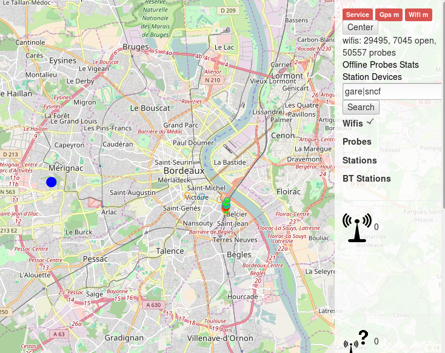
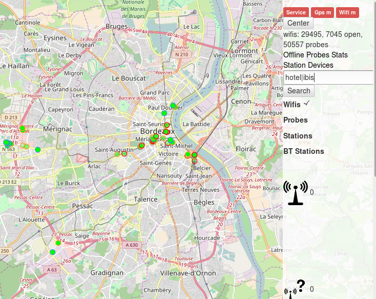

# Bordeaux: a digital urban exploration

## Wifi Dataset properties


- dates

   ````
   select min(date), max(date) from wifis limit  1
   "2016-02-20 14:15:19"	"2016-10-11 13:40:33"
   ````

- Count

    ````
    select count(*) from wifis;
    29494
    ````

    ````
    select count(*) from wifis where encryption = 0;
    7044
    ````

    ````
    select count(*) from probes;
    118052
    ````

- Coverage:

  

## What if you wanted to add some semantic to your map with some ...

- fast foods

   

- hospitals

   
   
- universities

   

- Railroad stations

   

- Public transports infrastructure

   

- Hotels

   

- Some french agencies ( Chambre de Commerce et d'Industrie de Bordeaux )

   

- The airport does not seems to be on the map but it should be somewhere around...

   

## Where people were connected before comming?

   

Mainly on public wifi, hotels and more than 633 from [Le Ceitya](http://www.hotel-leceitya.com/)

Public transport have their own infrastructure with 393 devices embedded within public buses looking for BUSTBC, and 108 devices within trams looking for SSID_TRAM and Depot_001.

You can even trace buses position


- 62 postmans using the [facteo](http://laposte.insa-rennes.fr/facteo/) service on a samsumg device


## What if you wanted to track people

### Through their bluetooth devices

   

   

### Through their wifi fingerprint

You may ever find that some people on the tram are close friends because of their probes request.
For exemple Sonos unique network ssid may be a good clue.

````select count(*) as count, essid from probes where essid like "sonos%" group by essid order by count DESC````

````
"count" "Essid"
"7"	"Sonos_uGUAzcgG5MiKVZHLXEYKt9dpUq"
"6"	"Sonos_0lg0ZdG5K83XtpaQJwRLPh9xy1"
"4"	"Sonos_LhNHzfI2obSstpRrQ9eHqdwzOG"
"4"	"Sonos_UMg5us2aiOPvDImCH5UhYncR3U"
"3"	"Sonos_Dyvs0V5MaULgQ1lOHtDNHj9mnH"
"3"	"Sonos_Jwk59FRebgm91DbJhoBturYHC5"
"3"	"Sonos_MzZ60CbYcrzizR8ltl98rkoJe9"
...
````

Don't forget that for each device, you are able to find where you scanned it, how many times...

## Going further

- All these scan were mainly done thanks to a Raspberry pi, a serial GPS and an external battery pack.
  But scanning more data at several city points to profile users and find people streams is also available with low cost devices such as esp8266. Using dns tunneling on available public networks, you can build cheaps scanners and drop them at some point of the city, to follow users, as explained in the [esp8266-wifiScanMap](https://github.com/mehdilauters/esp8266-wifiScanMap) project

  
  
- Associated with a more aggressive project, creating on-demand access point you can also improve you user profiling using dns queries, or even faking common protocols as done on the following [wifi](https://github.com/JDRobotter/wifi) project.


